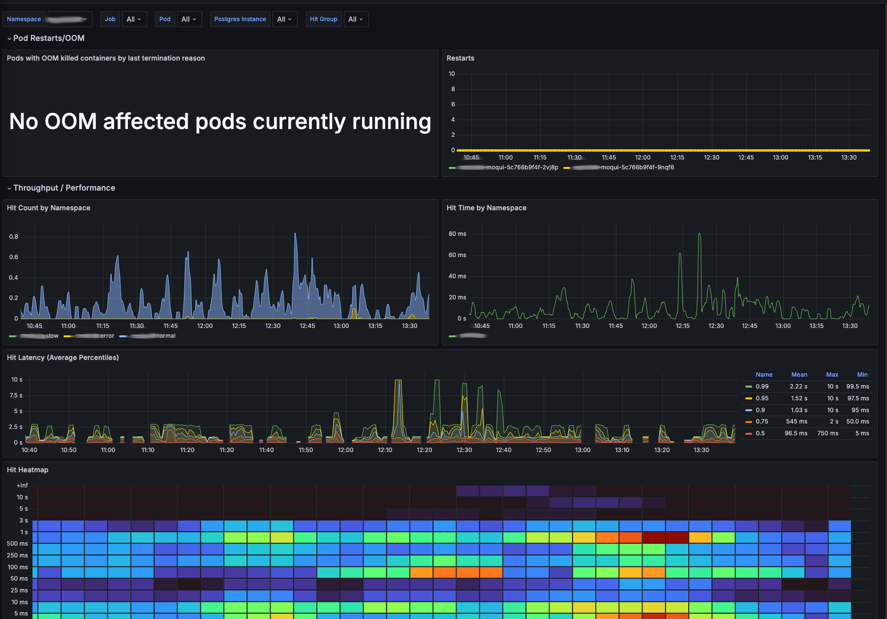
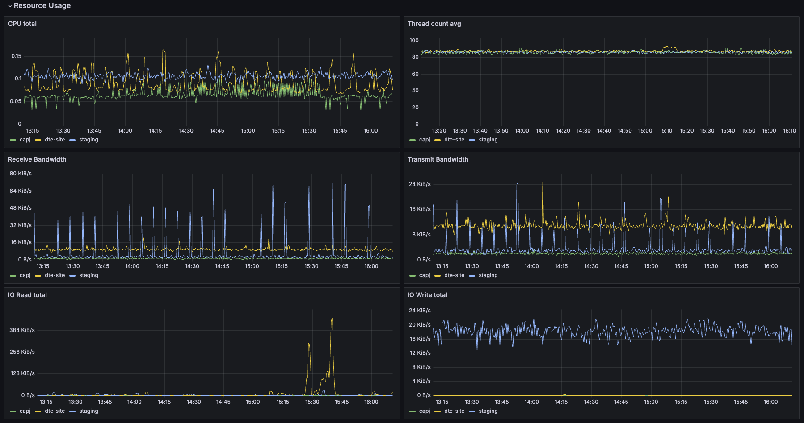
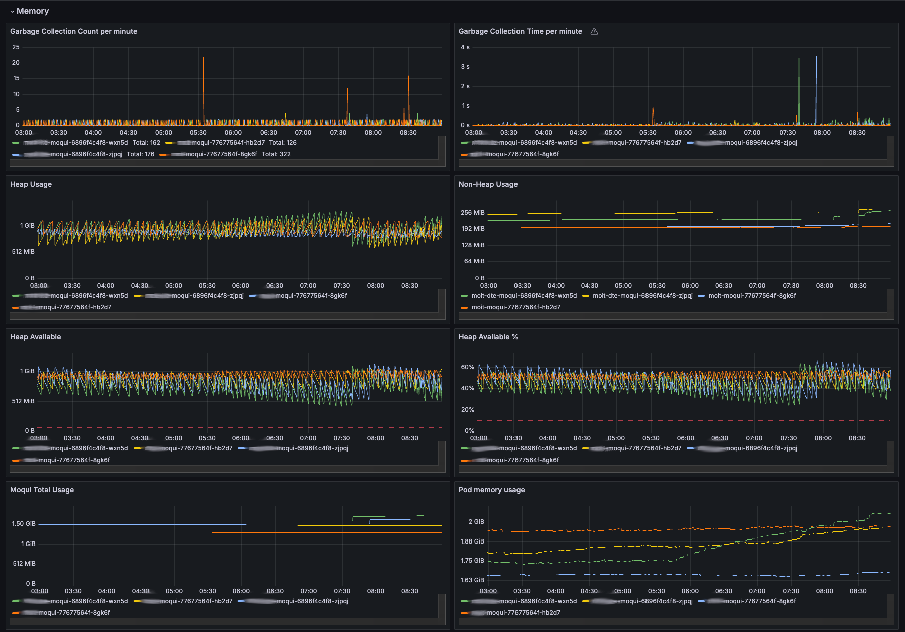
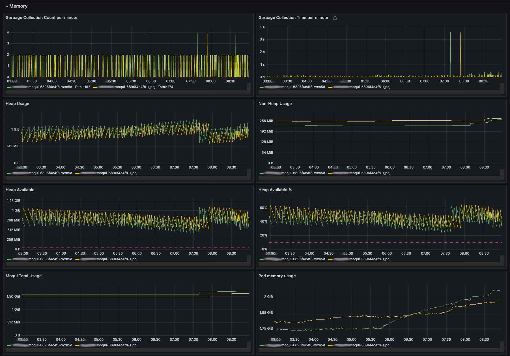
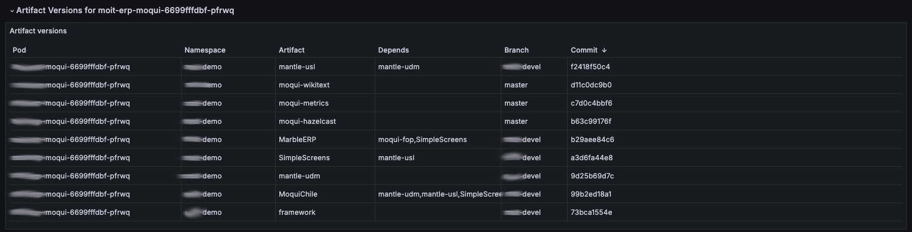

# Moqui Metrics

A module for [moqui-framework](https://github.com/moqui/moqui-framework) to make metrics available to monitoring tools, like [Prometheus](https://prometheus.io/).

# Sample Grafana Dashboard

See sample Grafana Dashboard in file `grafana/MoquiDashboard.json`, which includes visualizations like following:

## Restart-OOM and Throughput



## Resource Usage



## Memory Visualizations

Complete for several namespaces



And filtered by specific namespace



## Artifact Versions

See which specific commits were running in a specific pod at a given time.




# Supported Monitoring Tools

Currently, only Prometheus is supported. The URL to be used as target is the `/metrics/prometheus` path of your publically reachable moqui instance. If in your configuration the
public URL might reach more than one instance, you should add a unique name for each instance to be reached consistently, by e.g. using additional host names that are mapped to
only one instance.

# Configuration

This module currently has a setting to configure allowing access based on IP addresses using the `metrics_prometheus_servers` property.
This property can be set using java properties, environment vars or direct configuration in a `MoquiConf.xml` file. The value is a comma-separated list of hosts
(hostname or IP address), or the special value `private` which will match all IPv4 private address classes.

## Exporting metrics for Artifacts

Metrics for Artifacts are exported using the [prometheus histogram](https://prometheus.io/docs/practices/histograms/) type. You can create different histogram groups by adding
values to the `moqui.metrics.MetricsHitGroup` entity, and associating one or more artifacts to this counter using the `moqui.metrics.MetricsHitGroupArtifact` entry. By default,
for durations of 5, 10, 25, 50, 100, 250, 500, 1000, 3000, 5000 and 10000 ms are created, but you may specify custom buckets using the `moqui.metrics.MetricsHitGroupBucket`
entity.

The values for `artifactType` and `artifactName` should be the same than used in the `moqui.server.ArtifactHit` entity.

For example, in order to export all accesses to the Tools app, the `artifactType` would be set to `AT_XML_SCREEN` and the `artifactName` to `component://tools/screen/Tools.xml`
See [MetricsHitGroupDemoData](data/MetricsHitGroupDemoData.xml) for details.

## Prometheus

### Standalone Usage

1. Set the address(es) of the prometheus server as specified in the configuration
1. Configure prometheus to scrape the corresponding URL. For a prometheus server with a static configuration, something like this:
   ```
    scrape_configs:
      - job_name: 'External Moqui Instances'
        metrics_path: '/metrics/prometheus'
        scheme: https
        static_configs:
          - targets: [instance1.my-domain.com]
            labels:
              instance: 'instance1'
          - targets: [instance2.my-domain.com]
            labels:
              instance: 'instance1'
   ```

### Kubernetes Usage

#### Scraping auto-discovery

1. Make sure your prometheus server has endpoint services auto-discovery enabled (default for most installations)
2. Add the auto-discover labels to your moqui pods:
   * `prometheus.io/scrape=true`
   * `prometheus.io/path=/metrics/prometheus`
   * `prometheus.io/port=80` (or other port like 8080, according to your pod mapping)

#### Pod Monitor

Configure a PodMonitor that matches the running instance(s), e.g.:

```
apiVersion: monitoring.coreos.com/v1
kind: PodMonitor
spec:
  namespaceSelector:
    matchNames:
      - moit-dte
  podMetricsEndpoints:
    - path: /metrics/prometheus
      port: http
      scheme: http
  selector:
    matchLabels:
      app: moqui
```

